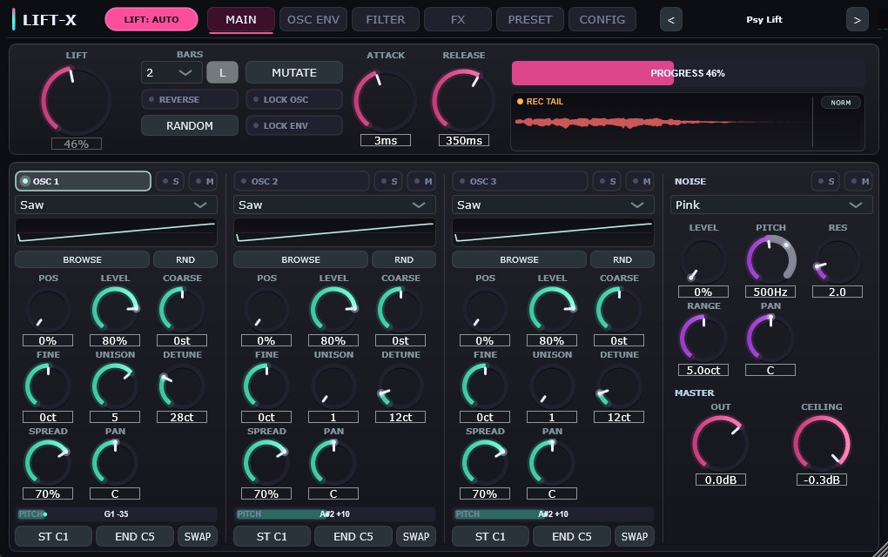
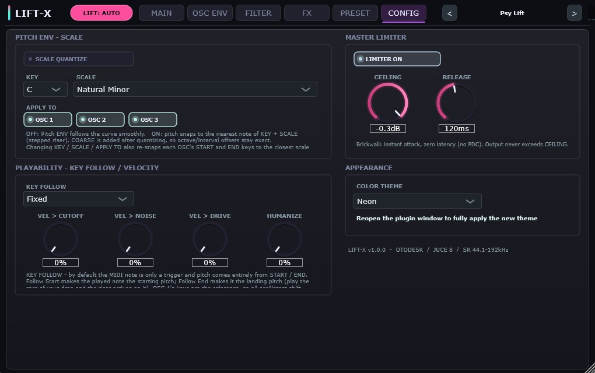
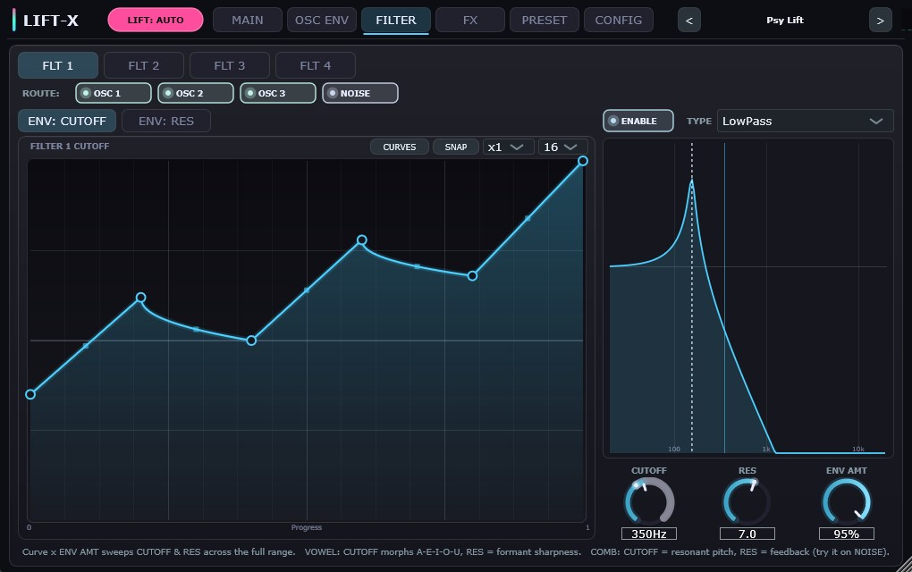
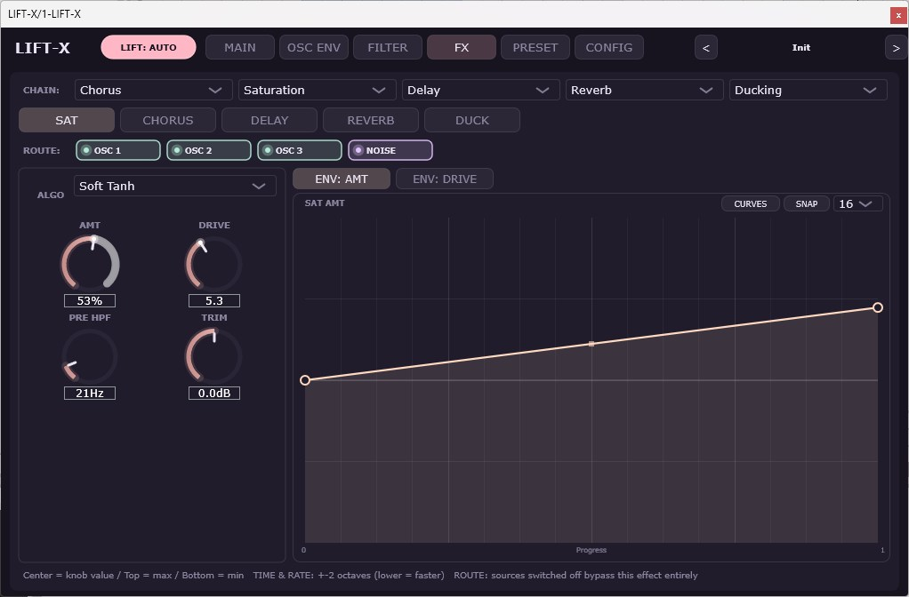
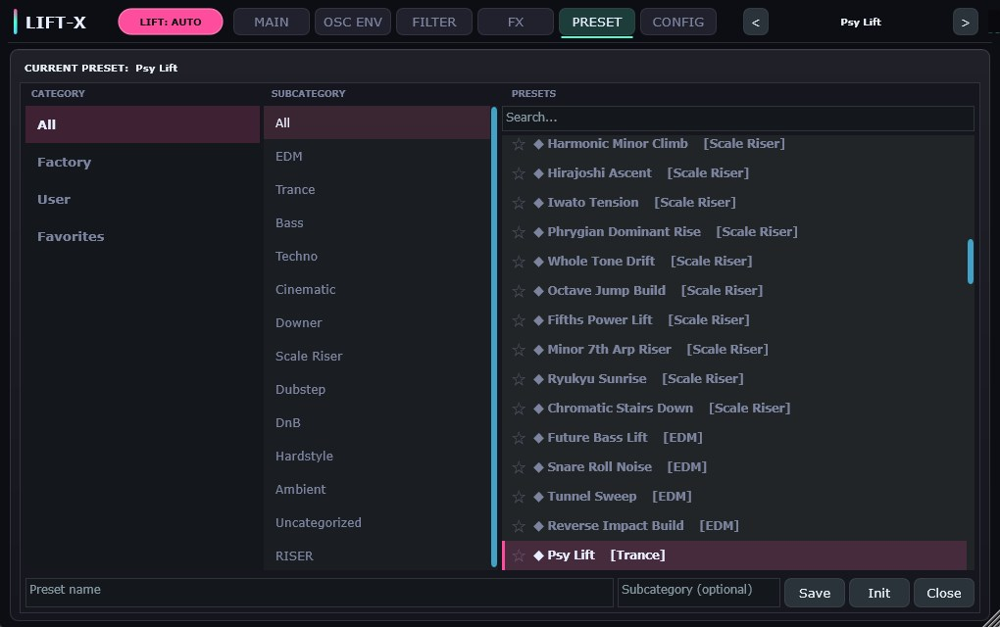
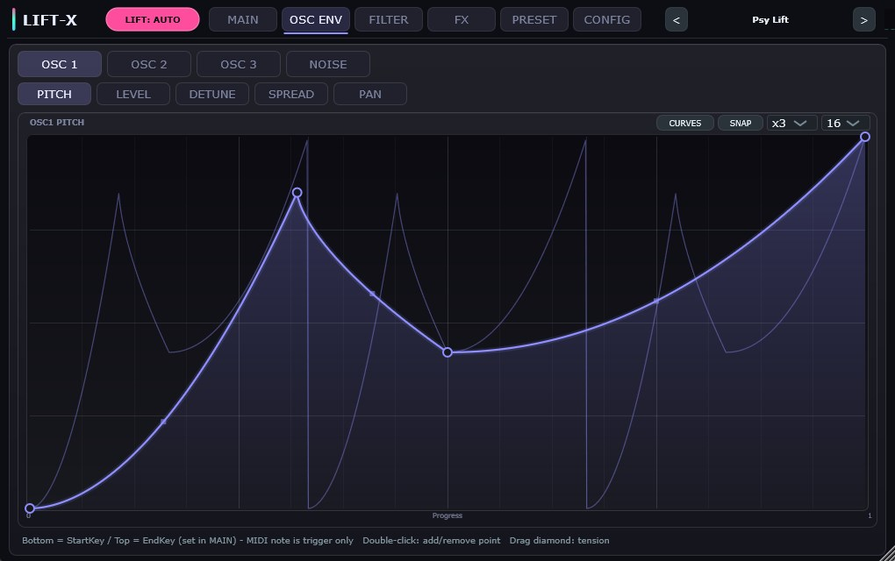

# LIFT-X


##


## Overview

**LIFT-X** is a riser-dedicated MIDI synthesiser VST3 built around one idea: **a riser is not an envelope — it is forty-one envelopes moving together.**

Most instruments give you one or two modulation sources and ask you to build a riser out of them. LIFT-X inverts that. Every parameter worth sweeping — three oscillator pitches, their levels, detune, stereo spread and **pan**, noise pitch/level/resonance/pan, four filter cutoffs, four filter resonances and fourteen FX parameters — gets its own multi-point curve, and all forty-one are read from the same playhead. Draw the shape you want on each one and they arrive together, locked to the host transport.

Any curve can also be set to **repeat** 2–32 times across the riser, which turns it into a tempo-synced LFO without adding a single new module: a Level curve at ×16 becomes a 16th-note gate, a Filter curve at ×8 becomes a wobble.

Pitch is handled differently too. The MIDI note is a **trigger only**; the actual pitch comes from a per-oscillator **Start Key → End Key** range, so a riser sweeps from exactly D2 to exactly G6 no matter which key you press. Turn on **Scale Quantize** and that sweep snaps to the notes of any of **70 scales**, turning a smooth glide into a stepped, in-key climb.

**Design goal:** total control over the shape of a transition, without leaving the plugin.


## Key Features

### 41 Multi-Point Envelopes on One Playhead

* **One playhead, forty-one curves.** LIFT is the evaluation position on the X axis of every curve. In AUTO it follows the host transport across the chosen bar length; in MANUAL it is a knob you can automate.
* **Up to 128 points per curve**, each segment with its own tension handle. The same `evaluate()` code runs in the DSP and in the drawing, so what you see is exactly what you hear.
* **Curves live outside the host parameter list.** They are stored in a lock-free `CurveStore` rather than APVTS, which structurally isolates them from Ableton Live's automation rewind behaviour.
* **REPEAT ×1–32.** Each curve carries its own repeat count. The editor keeps letting you draw a single cycle at full width and overlays a ghost of the repeated result, so precise editing and the actual output are both visible.
* **47 curve presets in eight categories** — Basic, Curved, Shape, Steps, Saw/Gate, Pulse, Motion and Random — reachable from a tree menu, plus Copy / Paste / "Paste to All" and Save/Load of your own shapes. Optional snap grid at 4/8/16/32/64 divisions.
* **HUMANIZE** adds a slow organic drift to the playhead so a riser is never perfectly mechanical.

### Absolute-Pitch Risers

* **Start Key → End Key per oscillator.** Press the ST or END button then play a note on your keyboard to set it (MIDI learn). The Pitch curve interpolates between them — bottom of the curve is Start, top is End.
* **MIDI note is trigger only.** The riser lands on the same notes every time regardless of which key fires it.
* **PITCH RAIL.** A live bar under each oscillator shows the current pitch as a note name, with tick marks at every scale tone in the Start–End span when quantizing.
* **Reverse.** One button flips the evaluation position to `1-pos`, reading all forty-one curves backwards — a riser becomes a downer and vice versa.
* **SWAP** exchanges Start and End on one oscillator when you want only the pitch direction inverted, leaving filter and FX curves untouched.
* **KEY FOLLOW (optional).** Off by default — the note stays a pure trigger. Set to *Follow Start* or *Follow End* and the whole pitch range transposes with the played note, so the riser lands on the root of your drop. OSC 1's keys are the reference, so every layer moves together and the intervals between them survive.

### Scale Quantize — 70 Scales



* **Stepped, in-key risers.** With quantize off the pitch glides along the curve; with it on the pitch snaps to the nearest note of the chosen Key and Scale, producing a staircase climb that always lands in key.
* **70 scales** across seven groups: Basic, Modes & Variants, World, Indian, Japan/Asia, Symmetric/Bebop and Chord Tones — from Major and Minor Pentatonic through Hirajoshi, Iwato and Ryukyu to Bebop Dominant and chord-tone sets like Minor 7th and Major 9th.
* **Per-oscillator apply.** Leave one oscillator unquantized to layer a smooth glide underneath a stepped one.
* **Quantize before COARSE.** The offset is added after snapping, so an oscillator set to +12 st stays exactly one octave above.
* **Automatic key snapping.** Changing Key, Scale or the apply toggles re-snaps each oscillator's Start and End keys to the closest scale tone. You can freely edit them afterwards, and preset loading never triggers it.

### Three Oscillators + Noise

* **Six wave modes** per oscillator — Sine, Triangle, Square, Saw, FM and **Wavetable** — with a POSITION knob that morphs continuously between frames.
* **Custom wavetables per oscillator**, loaded from a two-pane category browser with a RANDOM button. Your wavetable folder is remembered in a global settings file, so you register it once.
* **10-level mipmapped, FFT band-limited tables** — the harmonic count is chosen from the playback frequency, so a five-octave sweep does not alias at the top.
* **Up to 7-voice unison** with detune and stereo spread, both sweepable by their own curves.
* **White / Pink / Brown noise** through a dedicated band-pass, with its own pitch, resonance and range. Noise generation runs on a fixed 44.1 kHz clock and is interpolated up, so the spectrum is identical at every sample rate.

### Per-Source Filter Routing



* **Four filters, six types** — LP / HP / BP / Notch on a Cytomic-style ZDF/TPT state-variable core that stays stable under the fastest curve sweeps, plus two character types:
  * **VOWEL** — three band-passes on human formant frequencies; CUTOFF morphs A→E→I→O→U, so a filter sweep turns into a voice saying "aa-eh-ee".
  * **COMB** — a feedback resonator whose CUTOFF is a resonant pitch. Run noise through it and the noise acquires a note; combine it with Scale Quantize and the noise climbs a scale.
* **Independent cutoff and resonance curves** per filter (8 curves in total).
* **Each filter routes per source.** OSC 1–3 and Noise can be passed through or bypassed independently, so internally there are 4 × 4 = 16 filter instances.
* **Full-range envelope.** Cutoff × ENV AMT spans ±10 octaves, so the top of the curve always reaches maximum regardless of where the knob sits.

### Five-Slot FX Rack with Per-Effect Source Routing



* **Choose the order.** Five slots, each assigned Saturation, Chorus, Delay, Reverb, Ducking or **Stutter**.
* **Every effect routes per source.** Keep the sub oscillator out of the reverb, send only the noise to the delay, saturate OSC 1 while OSC 2 goes clean — 6 effects × 4 sources, individually switchable.
* **Saturation** with 10 ADAA algorithms (Soft Tanh, Hard Clip, Triode, Tape, Transformer, JFET, BJT, Wavefold, Exciter, Cubic), pre-HPF and output trim.
* **Tempo-locked Delay and Ducking.** Delay times and duck rates lock to the host PPQ from 1 Bar down to 1/64 with dotted and triplet values. Ducking needs no sidechain input.
* **Shimmer Reverb** — a 16-channel FDN with velvet-noise diffusion and an octave shifter.
* **Beat Stutter.** A tempo-synced beat-repeat built on a two-grain cycle, with a 3 ms crossfade at every grain edge so it never clicks even at 100 % amount. Automate the RATE curve and the chop tightens as the riser peaks.
* **Fourteen FX parameters are curve-modulated**, including Delay Time (±2 octaves of beat length), Duck Rate and Stutter Rate (quantised to musical multiples). Combo-box parameters show their curve-applied value as live text, so a modulation you cannot put a knob ring around is still visible.

### Riser Capture & WAV Export

* The plugin's own output is recorded from note-on. The body ends at the chosen bar length (or when the release finishes), then the tail keeps recording **until the sound actually stops** — silence detection at −90 dBFS rather than a fixed time, so a 30-second Shimmer decay or a 0.95-feedback delay is captured to its last audible sample. Up to 60 seconds.
* The waveform strip dims the tail region and marks the body/tail boundary, so you can see exactly what was captured.
* **Drag the waveform strip into your DAW** to drop it as a 32-bit float WAV at the session sample rate, with an 8 ms fade-out to prevent a click. **NORM** normalises the export to −0.3 dBFS.
* `getTailLengthSeconds()` is computed from the actual Reverb decay and Delay feedback, so host freeze and bounce do not cut the tail either.

### 134 Factory Presets



Eleven categories with **twelve or more each** — EDM, Trance, Bass, Techno, Cinematic, Downer, **Scale Riser**, Dubstep, DnB, Hardstyle and Ambient — covering waveforms, noise, filters, FX and curves, including a full showcase of the Vowel and Comb filters, Stutter, Pan envelopes and curve REPEAT. A three-column browser with subcategories, search, favourites and user presets sits on its own tab, and ◀▶ in the header steps through factory and user presets in one list.

**RANDOM** rerolls MAIN and OSC ENV inside musically safe bounds, with LOCK toggles for BARS, the oscillators and the curves so you can keep the part you like. **MUTATE** nudges the current sound instead of replacing it — the way to explore around a patch you already like (hold Shift for a bigger jump).


### Interface

* **Resizable, 50 %–200 %,** with a fixed aspect ratio — the whole UI scales as one, so nothing reflows or breaks.
* **Ten colour themes** (Midnight, Sakura, Ocean, Forest, Sunset, Mono, Neon, Vaporwave, Amber, Arctic) applied consistently across every tab, including the preset browser.
* **Embedded fonts** — Inter for the interface, JetBrains Mono for numeric readouts so digits never jitter. Both SIL OFL 1.1.
* **Modulation range rings.** Every curve-modulated knob shows the span its curve will travel plus a live dot at the current value, so you can see the modulation without opening the curve tab.
* **Output meter** in the header, and a **PITCH RAIL** under each oscillator showing the live note name.


## Parameter Reference

### Global (MAIN)

| Parameter | Range | Notes |
|---|---|---|
| **LIFT** | 0–100 % | Evaluation position of all 41 curves. Disabled in AUTO |
| **LIFT: AUTO / MANUAL** | toggle | AUTO follows the transport; MANUAL is host-automatable |
| **REVERSE** | on/off | Reads every curve backwards — riser ↔ downer |
| **RANDOM** | button | Randomises MAIN and OSC ENV only, never Master/FX/Config |
| **MUTATE** | button | Nudges the current sound (Shift = larger jump) |
| **L** (next to BARS) | toggle | Locks BARS — the bar length survives RANDOM, Init and preset loading |
| **LOCK OSC / LOCK ENV** | toggle | Excludes oscillators / curves from RANDOM |
| **BARS** | 1/32 … 16 | Length of one full 0→1 sweep (10 steps) |
| **ATTACK** | 0.1–500 ms | Amp envelope attack |
| **RELEASE** | 5–4000 ms | Amp envelope release |
| **OUT** | −24 … +12 dB | Master output |
| **CEILING** | −12 … 0 dB | Limiter ceiling (mirrors CONFIG) |

### Oscillator 1–3

| Parameter | Range | Notes |
|---|---|---|
| **ON / S / M** | toggle | Enable, Solo, Mute |
| **WAVE** | 6 modes | Sine, Triangle, Square, Saw, FM, Wavetable |
| **POS** | 0–100 % | Morph position (Wavetable mode) |
| **LEVEL** | 0–100 % | Curve-modulated |
| **COARSE** | −24 … +24 st | Added after scale quantizing |
| **UNISON** | 1–7 | Voice count |
| **DETUNE** | 0–100 ct | Curve-modulated |
| **SPREAD** | 0–100 % | Stereo width, curve-modulated |
| **FINE** | −100 … +100 ct | Added after scale quantizing, for layer thickness |
| **PAN** | L100 … C … R100 | Base position; the Pan curve swings around it |
| **ST / END** | C−2 … G8 | Start/End Key, set by MIDI learn |
| **SWAP** | button | Exchanges Start and End (pitch direction only) |

### Noise

| Parameter | Range | Notes |
|---|---|---|
| **TYPE** | White / Pink / Brown | Fixed 44.1 kHz generation, SR-independent |
| **LEVEL** | 0–100 % | Curve-modulated |
| **PITCH** | 20 Hz – 20 kHz | Band-pass centre, curve-modulated |
| **RES** | 0.5–12 | Band-pass Q, curve-modulated |
| **RANGE** | 0–10 oct | Depth of the pitch curve |
| **PAN** | L100 … C … R100 | Base position, curve-modulated |

### Filter 1–4

| Parameter | Range | Notes |
|---|---|---|
| **ENABLE** | on/off | |
| **ROUTE** | OSC1/2/3/Noise | Per-source pass or bypass |
| **TYPE** | LP / HP / BP / Notch / **Vowel** / **Comb** | ZDF/TPT SVF, plus formant and resonator modes |
| **CUTOFF** | 20 Hz – 20 kHz | Vowel: A→U morph position. Comb: resonant pitch |
| **RES** | 0.5–12 | Vowel: formant sharpness. Comb: feedback |
| **ENV AMT** | −100 … +100 % | Curve × ±10 octaves. Drives both the cutoff and resonance curves |

### FX

| Effect | Parameters |
|---|---|
| **Saturation** | AMT, ALGO (10), DRIVE 1–12, PRE HPF 20–2000 Hz, TRIM ±12 dB |
| **Chorus** | AMT, RATE 0.05–8 Hz, DEPTH, WIDTH |
| **Delay** | AMT, TIME (1/2 … 1/16T), FB 0–95 %, DUCK, DAMP |
| **Reverb** | AMT, DECAY, SHIMMER, DAMP, MOD |
| **Ducking** | AMT, RATE (1 Bar … 1/64), SHAPE 0.5–8 |
| **Stutter** | AMT, RATE (1 Bar … 1/64) — tempo-synced beat repeat |

All six have a **ROUTE** row for OSC 1–3 and Noise.

### Config

| Parameter | Range | Notes |
|---|---|---|
| **SCALE QUANTIZE** | on/off | Default off |
| **KEY** | C … B | |
| **SCALE** | 70 scales | Grouped by category |
| **APPLY TO** | OSC 1/2/3 | Per-oscillator |
| **KEY FOLLOW** | Fixed / Follow Start / Follow End | Default Fixed = note is trigger only |
| **VEL > CUTOFF / NOISE / DRIVE** | 0–100 % | 0 % = velocity affects level only (original behaviour) |
| **HUMANIZE** | 0–100 % | Slow organic drift of the envelope position |
| **LIMITER ON** | on/off | Brick-wall, zero latency, no PDC |
| **CEILING** | −12 … 0 dB | |
| **RELEASE** | 20–1000 ms | |
| **COLOR THEME** | 10 themes | Midnight, Sakura, Ocean, Forest, Sunset, Mono, Neon, Vaporwave, Amber, Arctic |

### Curve Editor



* **Double-click** to add or remove a point, **drag the diamond** on a segment to bend it.
* **CURVES** opens a category tree of 47 factory shapes (Basic / Curved / Shape / Steps / Saw-Gate / Pulse / Motion / Random), plus Copy, Paste, "Paste to All", "Save Current…" and your saved user curves.
* **REPEAT ×1–32** turns the curve into a tempo-synced LFO. You keep editing one cycle at full width; the repeated result is drawn as a ghost overlay with cycle dividers.
* **Hover** highlights points and tension handles; **dragging** shows a live value badge.
* **SNAP** locks point X positions to a 4/8/16/32/64 grid with guide lines.
* Bipolar curves show a centre line: **centre = knob value, top = maximum, bottom = minimum**.


## Signal Flow

```
MIDI note (trigger only)
   │
   ├─ Transport sync (PPQ) ──► Progress 0→1 over BARS
   │                              │
   │                    LIFT (AUTO=Progress / MANUAL=knob)
   │                              │  × REVERSE → 1-pos
   │                              ▼
   │                    ┌── 41 curves evaluated at one playhead ──┐
   │                    │   (each with its own REPEAT ×1–32)       │
   │                    │                                          │
   ▼                    ▼                                          ▼
OSC 1 ─ wavetable ─ unison ─┐                            Filter cutoff/res
OSC 2 ─ wavetable ─ unison ─┤─ per-source filter routing        FX params
OSC 3 ─ wavetable ─ unison ─┤   (4 filters × 4 sources)         Pan
Noise ─ band-pass ──────────┘   LP/HP/BP/Notch/Vowel/Comb
   │
   ▼
Per-source pan (equal power) ──► 4 separate source buses
   │
   ▼
FX chain (5 slots, per-effect source routing)
   │   Saturation / Chorus / Delay / Reverb / Ducking / Stutter
   ▼
Bus sum ──► Master gain ──► Safety clip ──► Brick-wall limiter ──► Output
                                                     │
                                                     └─► Riser capture → WAV drag
```

Pitch is computed as `StartKey + (EndKey − StartKey) × curve`, plus the Key Follow offset, optionally snapped to Key + Scale, then COARSE and FINE are added.


## Real-Time Safety

* **No allocation or locking in `processBlock`.** Every buffer — oscillator tables, filter states, source buses, FX delay lines, the capture buffer — is sized in `prepareToPlay`.
* **Lock-free curve publishing.** The editor writes into an 8-slot ring per curve and publishes an atomic index; the audio thread only ever reads.
* **Sample-rate independent smoothing.** Control-tick coefficients are derived from real-time constants, so 44.1 kHz and 192 kHz behave identically. Noise is generated on a fixed 44.1 kHz clock and interpolated, keeping the Pink/Brown spectrum and White level constant across sample rates.
* **Two-stage declick on retrigger.** A note-on during playback fades out over 1.5 ms, performs every reset while the output is exactly zero, then fades back in — so phase resets, smoother snaps and filter clears can never produce a step.
* **DAW fail-safe layer.** Sample-rate mismatch or an absurd block size clears the buffer and resets the engine instead of producing garbage. Block sizes larger than the host advertised are absorbed by generous pre-allocation.
* **Bounded state.** Filter and noise cutoff targets are clamped to 20 Hz – 0.45 × SR, delay feedback tops out at 0.95, inter-slot soft clipping sits between FX slots, and a brick-wall limiter guards the output.
* **No locks taken from the audio thread.** Parameter-change notifications only set an atomic flag; a message-thread timer performs the work, so the audio thread never touches the message queue.
* **Sample-accurate note handling.** The block is split at MIDI event positions, so a riser starts exactly on its note rather than at the next block boundary.
* **Background-safe file work.** Wavetable decoding, FFT mip building and preset I/O run on the message thread; the audio thread reads an atomic pointer that is never freed while it might be in use.


## 📚 Manual

Quick manuals covering every tab and parameter, plus starting-point settings and troubleshooting:

[  ](Source/Assets/LIFTX_Manual_EN.md)
[  ](Source/Assets/LIFTX_Manual_JP.md)


## Installation

1. Download `LIFT-X.vst3` from the Releases page.
2. Copy it to your VST3 directory:
   ```
   C:\Program Files\Common Files\VST3\
   ```
3. Rescan plugins in your DAW.

### Build Requirements

* **JUCE** 8.0.x — place at `C:/JUCE` or update `JUCE_PATH` in `CMakeLists.txt`
* **CMake** 3.22 or higher
* **Visual Studio** 2022 (MSVC, C++20)

```bash
cmake -B build -DJUCE_PATH=C:/JUCE
cmake --build build --config Release
```

`COPY_PLUGIN_AFTER_BUILD` is enabled, so the VST3 is copied to the system VST3 folder automatically after a successful build.


## System Requirements

* **OS:** Windows 10 / 11 (64-bit)
* **Format:** VST3 / Standalone
* **Sample rates:** 44.1 – 192 kHz
* **Tested Host:** Ableton Live 11 / 12

> ⚠️ **Compatibility Notice:** Verified operation is confirmed in **Ableton Live**. Other DAWs may work but are currently unverified.


## Tips

* **Start from a preset, then redraw one curve.** The factory bank is built so that changing a single Pitch or Filter curve gives you a different riser rather than a broken one.
* **Stepped climbs that stay in key:** turn on Scale Quantize, pick Minor Pentatonic, and set an oscillator's Start/End three octaves apart. The pitch walks up the scale instead of gliding.
* **Layer stepped and smooth:** leave OSC 2 out of APPLY TO so it glides underneath the quantized OSC 1. The two together read as one instrument.
* **Turn any riser into a downer:** press REVERSE. Every curve — pitch, filter, FX — flips at once, which is far more convincing than reversing the pitch alone.
* **Feed only the noise to the delay.** On the DELAY tab switch OSC 1–3 off in ROUTE and leave NOISE on. The tonal layer stays dry while the noise builds a rhythmic tail.
* **Keep the sub clean:** on the REVERB tab, switch off the oscillator carrying the low octave. The top stays wide and the bottom stays defined.
* **RANDOM as a starting point.** It only touches MAIN and OSC ENV, so you can keep an FX chain you like and reroll the tonal layer underneath it.
* **Draw the shape you hear.** Use a Steps 8 or 16 curve preset on Pitch for machine-gun risers, and an Exp Up (Hard) on Filter for the classic late-opening sweep.
* **Bounce without rendering:** trigger the riser once, then drag the waveform strip straight into your arrangement as a WAV. Enable **NORM** if you want every export to land at −0.3 dBFS.
* **Any curve is an LFO.** Load *Gate 25 %* on OSC 1 Level and set REPEAT to ×16 — instantly a 16th-note gate locked to the bar. Put the same idea on a Filter curve for a wobble, and automate the Stutter RATE curve so the chop tightens into the drop.
* **Make noise sing.** Set a filter to **Comb**, route only NOISE to it, and turn Scale Quantize on. The noise picks up a pitch and walks up the scale — a texture you cannot get from a band-pass.
* **Talking risers.** Set a filter to **Vowel** and give it a Filter curve that goes low → high → mid. The formants read as "aa-ee-oh" instead of a filter sweep.
* **Widen without chorus.** Give OSC 1 a Pan curve that travels left→right and OSC 2 the mirror image. The stereo image opens as the riser climbs, and it stays mono-compatible because the pan law is equal power.
* **Explore, don't reroll.** When a patch is nearly right, press **MUTATE** repeatedly instead of RANDOM. Lock BARS with the small **L** button so the length stays glued to your arrangement.
* **Audition presets at your own length.** With **L** on, the bar length you chose survives every preset change, so you can step through the whole factory bank with ◀▶ and hear each one at the length your arrangement actually needs. Session recall is unaffected — a saved project always reopens exactly as you left it.


## License

This project is licensed under the GNU Affero General Public License v3.0 (AGPLv3) — see [LICENSE](LICENSE) for details.

This software is built with the **JUCE 8** framework. In accordance with JUCE 8's open-source licensing terms, this entire project is distributed under the AGPLv3.


## Credits

**Developer:** @kijyoumusic (OTODESK)

**Framework:** JUCE 8.0.x

**Target DAW:** Ableton Live 11 / 12

**DSP References:**
- Zavalishin — *"The Art of VA Filter Design"* (TPT/SVF topology)
- Simper (Cytomic) — *Trapezoidal integrated state-variable filters*
- Parker, Zavalishin & Le Bivic — *"Reducing the Aliasing of Nonlinear Waveshaping Using Continuous-Time Convolution"* (ADAA, 2016)
- Kellett — *Pink noise filter coefficients*
- Jot & Chaigne — *"Digital Delay Networks for Designing Artificial Reverberators"* (FDN, 1991)


## Support

Found a bug or have a feature request? Please open an issue on the repository.
